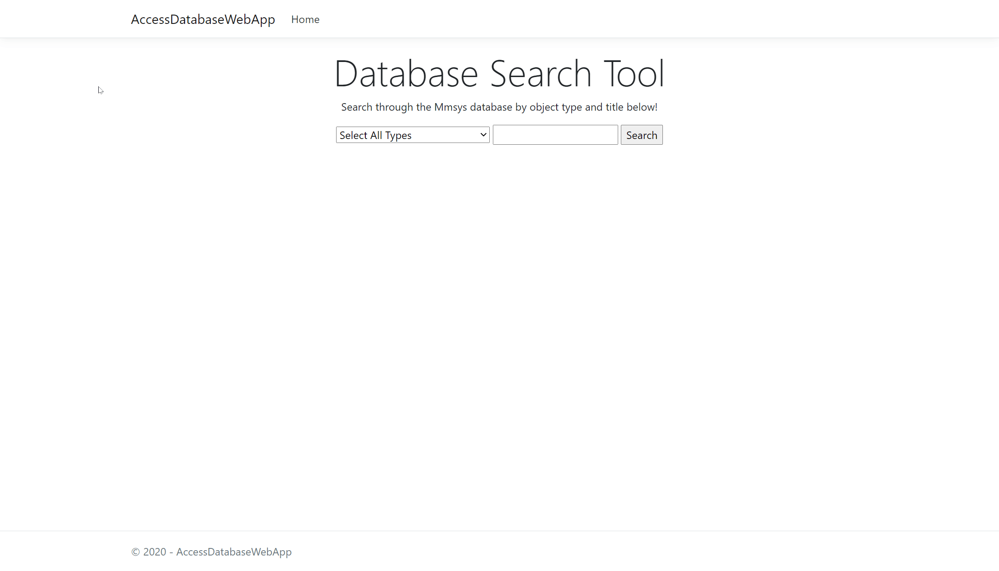

# AccessDatabaseWebApp
 ASP.NET Core Web Application thats connected to and searches a local database. Orginally used a Microsoft Access DB, but converted it to SQLite for support on Microsoft Azure. This project was used as an opportunity to learn ASP.NET Core 3.1, the MVC architecture, C# and deploying to Microsoft Azure with 0 knowledge.
 
 # Tools Used
 - Visual Studio 2019
 - ASP.NET Core 3.1 MVC
 - C#
 - Microsoft Azure
 - SQLite (Converted from Microsoft Access Database)
 - Dapper & SQLite Connection to connect to SQLite DB (Orignally used OleDB Connection for Micrososft Access DB)
 
 # Learning Resources
 - [IAmTimCorey Youtube Videos](https://www.youtube.com/user/IAmTimCorey/videos)
 - [ASP.NET Core 101 Series](https://www.youtube.com/playlist?list=PLdo4fOcmZ0oW8nviYduHq7bmKode-p8Wy)
 - [ASP.NET Core Documentation](https://docs.microsoft.com/en-us/aspnet/core/?view=aspnetcore-3.1)

 ## [Live Demo](https://accessdatabasewebappdemo.azurewebsites.net/)

## Search Tool

Database contains list of records and related documents. User can search through database by object type and title.

## Results

After conducting a search, a list of records are displayed based on search requirements. Pressing the checkbox and display button for a record will display full records and a list of related documents to that record.
